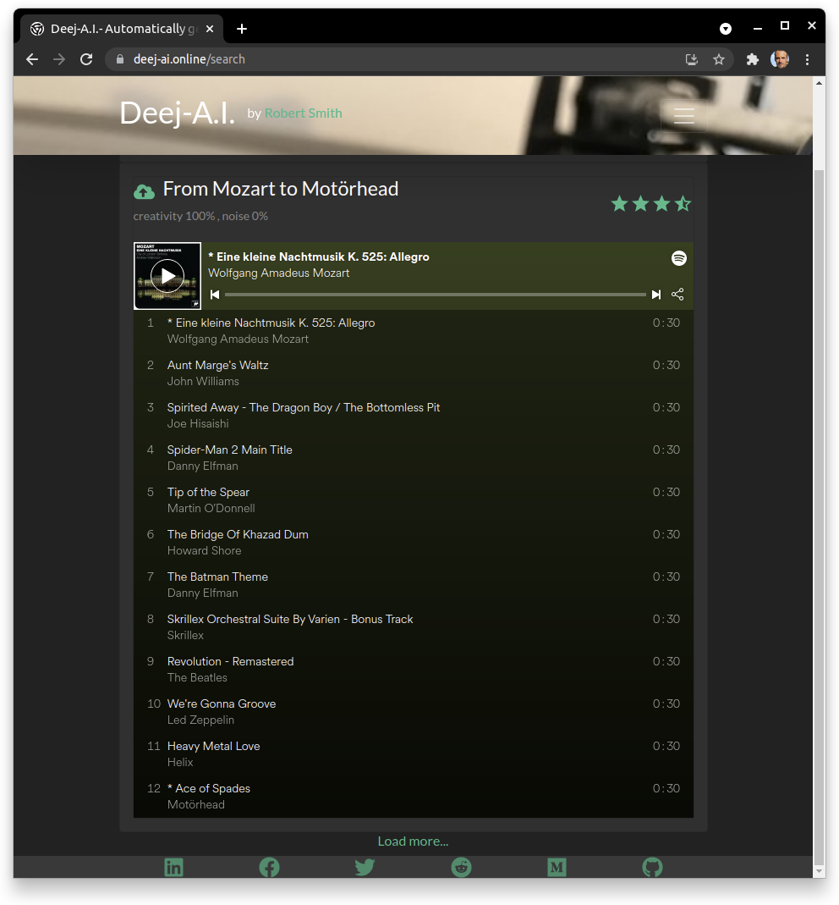
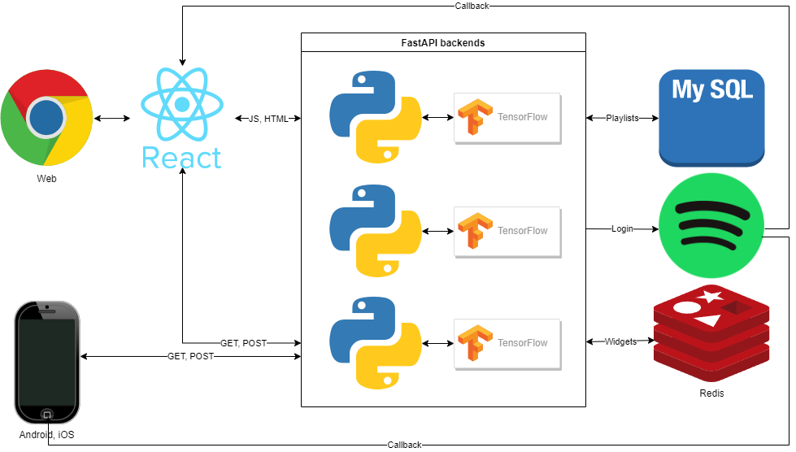
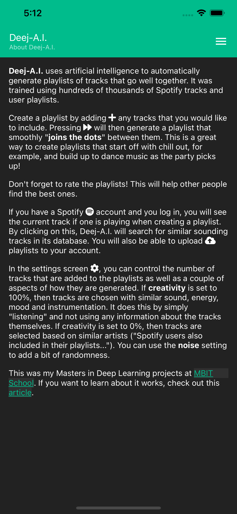
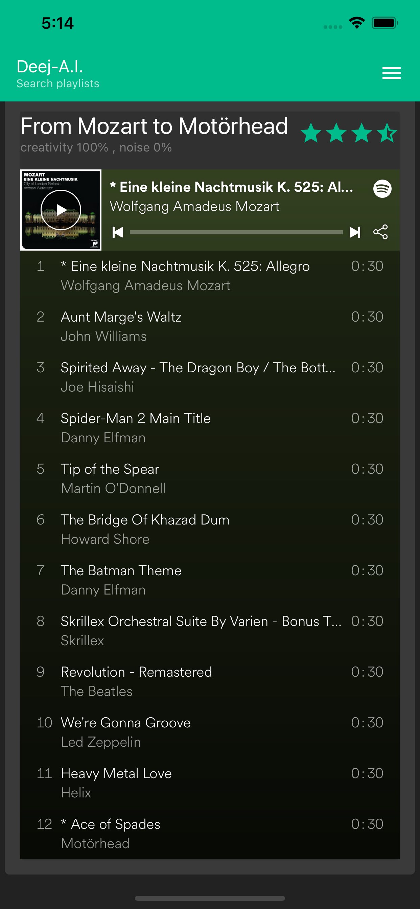

# Deej-A.I. React App   [](https://stackshare.io/teticio/deej-a-i)

This is the source code for my webpage which is hosted at https://deej-ai.online/. If you are interested in the deep learning models that are used in the backend, have a look at my other repo https://github.com/teticio/Deej-A.I./.



---
## TL;DR
```
git clone https://github.com/teticio/deej-ai.online-app.git
cd deej-ai.online
make help
```

---
## Technical features

* FastAPI backend server that handles calls to TensorFlow deep learning models, serves web content, manages the database (SQL, SQLite, etc.) and takes care of the Spotify authentication flow.
* Dockerized for reproducibility.
* Scalable and highly available Kubernetes deployment which is easy to install on a cloud or bare metal server using Helm.
* SSL certificates for HTTPS connections provisioned automatically using Let's Encrypt.
* Responsive ReactJS frontend web app and React Native app for iOS and Android using common codebase.
* Client-side caching with service workers and server-side caching using Redis.
* PWA (Progressive Web App) that can be installed on the desktop.
* Automated unit tests and linting with Travis CI and / or GitHub Actions.
* Electron desktop app ready to deploy to Snap, Windows and Mac App Stores.

## Installation

In order to run this, you will need to download the following files to the root directory:

* https://drive.google.com/file/d/1geEALPQTRBNUvkpI08B-oN4vsIiDTb5I/view?usp=sharing
* https://drive.google.com/file/d/1Mg924qqF3iDgVW5w34m6Zaki5fNBdfSy/view?usp=sharing
* https://drive.google.com/file/d/16JKjDGW2BMP-0KKJLFvwRvJdKhwukBeB/view?usp=sharing
* https://drive.google.com/file/d/1tLT_wmATWMC5UU-kERLsUNNcz0Vo19J3/view?usp=sharing
* https://drive.google.com/file/d/1LM1WW1GCGKeFD1AAHS8ijNwahqH4r4xV/view?usp=sharing

The easiest way to do this is by running
```
make download
```
This will also create a `credentials.py` file in the `backend` directory, which you should update with your Spotify Developer API credentials. These can be obtained from https://developer.spotify.com/dashboard/login.
```
SPOTIFY_CLIENT_ID='<Your client ID>'
SPOTIFY_CLIENT_SECRET='<Your secret>'
SPOTIFY_REDIRECT_URI='<Your external webpage URL>/api/v1/callback'
```
You should also set `REACT_APP_API_URL` to `'<Your external webpage URL>/api/v1'` in `.env.production` and `APP_URL` to `<Your external webpage URL>` in `scripts/run.sh`. If you want to avoid having to install Redis for caching requests, you should set the environment variable `NO_CACHE`. Assuming you have `pipenv` and `yarn` already installed, you can type
```
make install
```
and
```
make run
```
(In Windows, you will either have to run these commands in a Git Bash shell or adapt the scripts as appropriate). As a final step, you can then set up a reverse proxy to `http://localhost:8000/`.)

## Deployment on a Kubernetes cluster with Helm



To build the Docker image, run
```
make docker
```
You will need to have already created your `credentials.py`, as explained above. To install the Helm chart type
```
make k8s
```
The scripts assume you are running a `minikube`. This will install the backend FastAPI server, an SQL database to store the playlists and a Redis instance to cache server side static requests. To install on an AWS cluster with kOps run
```
scripts/deploy_kops.sh <Your external webpage domain>
```
provided your domain is hosted by Route 53 and you have configured the [DNS, S3 and IAM settings](https://aws.amazon.com/blogs/compute/kubernetes-clusters-aws-kops/) appropriately to run kOps. If everything has gone to plan,
```
kubectl get svc -n deejai
```
will return an external IP for the Elastic Load Balancer (ELB). You will need to point your domain to the ELB by editing the relevant A record for your hosted zone in the AWS console. It will then automatically provision an SSL certificate for HTTPS connections.

## Amazon ECS on AWS Fargate

You can also deploy the application as what I call a "serverless server" on AWS Fargate. It is "serverless" in the sense that you don't need to provision a server, but "serverful" in that it runs a Fargate task 24x7. The advantages are that you don't have to worry about patching your EC2 instances and it is very easy to update or restart at the click of a button. Running
```
TF_VAR_domain='<Your external webpage domain>' make tf_apply
```
in the `terraform` directory will create a VPC and Fargate ECS cluster and point your website to an Application Load Balancer. It currently uses a single Docker image running just the FastAPI server with persistent EFS storage. An advantage of Fargate is that you can use spot instances which are up to 70% cheaper than on-demand ones and are supposedly only interrupted about 5% of the time. To tear it down again
```
make tf_destroy
```

(While I was developing this script, my `terraform.tfstate` got in a bit of a state, so I had to destroy all the resources it had created by hand. I found it oddly reminiscent of trying to open one of those Japanese puzzle boxes as it would only let me delete the resources in exactly the right order.)

## React Native

 

ReactJS and React Native are very similar but quite different at the same time. I wanted to avoid duplicating code as much as possible (following the DRY - Don't Repeat Yourself - principle) so I have wrapped the platform specific code in `Platform.js` and `Platform.native.js`. In particular, the standard HTML tags like `<h1>` or `<a>` have been replaced with wrapper components (e.g., `Text` and `Link`). To run on iOS or Android using Expo type
```
yarn start-native
```
You can build an APK or IPA if you have an Expo account with
```
expo build:android
```
or
```
expo build:ios
```

## Electron

Electron is a great way to build and distribute JavaScript applications for the desktop (Windows, Mac, Linux) - Visual Studio Code is a good example of just what can be achieved. To build the application for your platform, type
```
yarn make
```
You will find the installers for your platform under the ```electron\out\make``` directory. Initially, I attempted to use the same ```package.json``` file for everything: ReactJS, React Native and Electron. It turned out to be very complicated to ensure that Electron packaged everything up correctly without interfering with React. It seems much neater to create a specific ```package.json``` file in a separate directory ```electron``` which has only the minimal ```node_modules``` needed - which are very few as the application has already been packaged with Webpack.
