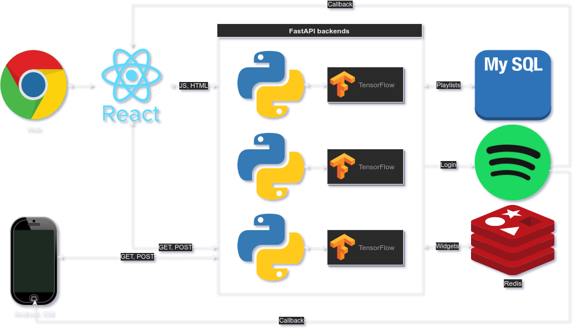

# Deej-A.I. React App   [](https://stackshare.io/teticio/deej-a-i)

This is the source code for my webpage which is hosted at https://deej-ai.online/. If you are interested in the deep learning models that are used in the backend, have a look at my other repo https://github.com/teticio/Deej-A.I./.


---
## Technical features

* FastAPI backend server that handles calls to TensorFlow deep learning models, serves web content, manages the database (SQL, SQLite, etc.) and takes care of the Spotify authentication flow.
* Dockerized for reproducibility.
* Scalable and highly available Kubernetes deployment which is easy to install on a cloud or bare metal server using Helm.
* SSL certificates for HTTPS connections provisioned automatically using Let's Encrypt.
* Responsive ReactJS frontend web app and React Native app for iOS and Android using common codebase.
* Client-side caching with service workers and server-side caching using Redis.
* PWA (Progressive Web App) that can be installed on the desktop.
* Automated unit tests and linting with Travis CI and / or GitHub Actions.

---
## Installation

In order to run this, you will need to create a `credentials.py` file in the `backend` directory with your Spotify Developer API credentials, which can be obtained from https://developer.spotify.com/dashboard/login.

```
CLIENT_ID = '<Your client ID>'
CLIENT_SECRET = '<Your secret>'
REDIRECT_URI = '<Your external webpage URL>/api/v1/callback'
```

You will also need to download the following files to the root directory:

* https://drive.google.com/file/d/1geEALPQTRBNUvkpI08B-oN4vsIiDTb5I/view?usp=sharing
* https://drive.google.com/file/d/1Mg924qqF3iDgVW5w34m6Zaki5fNBdfSy/view?usp=sharing
* https://drive.google.com/file/d/16JKjDGW2BMP-0KKJLFvwRvJdKhwukBeB/view?usp=sharing
* https://drive.google.com/file/d/1tLT_wmATWMC5UU-kERLsUNNcz0Vo19J3/view?usp=sharing
* https://drive.google.com/file/d/1LM1WW1GCGKeFD1AAHS8ijNwahqH4r4xV/view?usp=sharing

The easiest way to do this is by running `python download.py`. You should also set `REACT_APP_API_URL` to `'<Your external webpage URL>/api/v1'` in `.env.production` and `APP_URL` to `<Your external webpage URL>` in `run.sh`.

If you want to avoid having to install Redis for caching requests, you should set the environment variable `NO_CACHE`. Assuming you have `pipenv` and `yarn` already installed, you can type
```
./install.sh
```
and
```
./run.sh
```
(In Windows, you will either have to run these commands in a Git Bash shell or adapt the scripts as appropriate). As a final step, you can then set up a reverse proxy to `http://localhost:8000/`.

## Deployment on a Kubernetes cluster with Helm



To build the Docker image, run
```
./build_docker.sh
```
You will need to have already created your `credentials.py`, as explained above. To install the Helm chart type
```
./install_helm.sh
```
The scripts assume you are running a `minikube`. This will install the backend FastAPI server, an SQL database to store the playlists and a Redis instance to cache server side static requests. To install on an AWS cluster with Kops
```
./deploy_kops.sh <Your external webpage domain>
```
provided your domain is hosted by Route 53 and you have configured the [DNS, S3 and IAM settings](https://aws.amazon.com/blogs/compute/kubernetes-clusters-aws-kops/) appropriately to run Kops. If everything has gone to plan,
```
kubectl get svc -n deejai
```
will return an external IP for the Elastic Load Balancer (ELB). You will need to point your domain to the ELB by editing the relevant A record for your hosted zone in the AWS console. It will then automatically provision an SSL certificate for HTTPS connections.

## React Native

 

ReactJS and React Native are very similar but quite different at the same time. I wanted to avoid duplicating code as much as possible (following the DRY - Don't Repeat Yourself - principle) so I have wrapped the platform specific code in `Platform.js` and `Platform.native.js`. In particular, the standard HTML tags like `<h1>` or `<a>` have been replaced with wrapper components (e.g., `Text` and `Link`). To run on iOS or Android using Expo type
```
yarn start-native
```
You can build an APK or IPA if you have an Expo account with
```
expo build:android
```
or
```
expo build:ios
```
## Tech stack
<div style="display: flex; flex-wrap: wrap">
	<div style="padding: 5px 5px; width: 100px">
		<div></div>
		<div>JavaScript</div>
	</div>
	<div style="padding: 5px 5px; width: 100px">
		<div></div>
		<div>Python</div>
	</div>
	<div style="padding: 5px 5px; width: 100px">
		<div></div>
		<div>React</div>
	</div>
	<div style="padding: 5px 5px; width: 100px">
		<div></div>
		<div>MySQL</div>
	</div>
	<div style="padding: 5px 5px; width: 100px">
		<div></div>
		<div>Bootstrap</div>
	</div>
	<div style="padding: 5px 5px; width: 100px">
		<div></div>
		<div>Redis</div>
	</div>
	<div style="padding: 5px 5px; width: 100px">
		<div></div>
		<div>React Native</div>
	</div>
	<div style="padding: 5px 5px; width: 100px">
		<div></div>
		<div>SQLite</div>
	</div>
	<div style="padding: 5px 5px; width: 100px">
		<div></div>
		<div>React Router</div>
	</div>
	<div style="padding: 5px 5px; width: 100px">
		<div></div>
		<div>SQLAlchemy</div>
	</div>
	<div style="padding: 5px 5px; width: 100px">
		<div></div>
		<div>Expo</div>
	</div>
	<div style="padding: 5px 5px; width: 100px">
		<div></div>
		<div>FastAPI</div>
	</div>
	<div style="padding: 5px 5px; width: 100px">
		<div></div>
		<div>Bootswatch</div>
	</div>
	<div style="padding: 5px 5px; width: 100px">
		<div></div>
		<div>Uvicorn</div>
	</div>
	<div style="padding: 5px 5px; width: 100px">
		<div></div>
		<div>TensorFlow</div>
	</div>
	<div style="padding: 5px 5px; width: 100px">
		<div></div>
		<div>Keras</div>
	</div>
	<div style="padding: 5px 5px; width: 100px">
		<div></div>
		<div>React Navigation</div>
	</div>
	<div style="padding: 5px 5px; width: 100px">
		<div></div>
		<div>React Native Paper</div>
	</div>
	<div style="padding: 5px 5px; width: 100px">
		<div></div>
		<div>GitHub</div>
	</div>
	<div style="padding: 5px 5px; width: 100px">
		<div></div>
		<div>Docker</div>
	</div>
	<div style="padding: 5px 5px; width: 100px">
		<div></div>
		<div>Visual Studio Code</div>
	</div>
	<div style="padding: 5px 5px; width: 100px">
		<div></div>
		<div>Kubernetes</div>
	</div>
	<div style="padding: 5px 5px; width: 100px">
		<div></div>
		<div>Webpack</div>
	</div>
	<div style="padding: 5px 5px; width: 100px">
		<div></div>
		<div>ESLint</div>
	</div>
	<div style="padding: 5px 5px; width: 100px">
		<div></div>
		<div>Babel</div>
	</div>
	<div style="padding: 5px 5px; width: 100px">
		<div></div>
		<div>Yarn</div>
	</div>
	<div style="padding: 5px 5px; width: 100px">
		<div></div>
		<div>Travis CI</div>
	</div>
	<div style="padding: 5px 5px; width: 100px">
		<div></div>
		<div>Jest</div>
	</div>
	<div style="padding: 5px 5px; width: 100px">
		<div></div>
		<div>GitHub Actions</div>
	</div>
	<div style="padding: 5px 5px; width: 100px">
		<div></div>
		<div>Helm</div>
	</div>
	<div style="padding: 5px 5px; width: 100px">
		<div></div>
		<div>pytest</div>
	</div>
	<div style="padding: 5px 5px; width: 100px">
		<div></div>
		<div>Pylint</div>
	</div>
</div>
